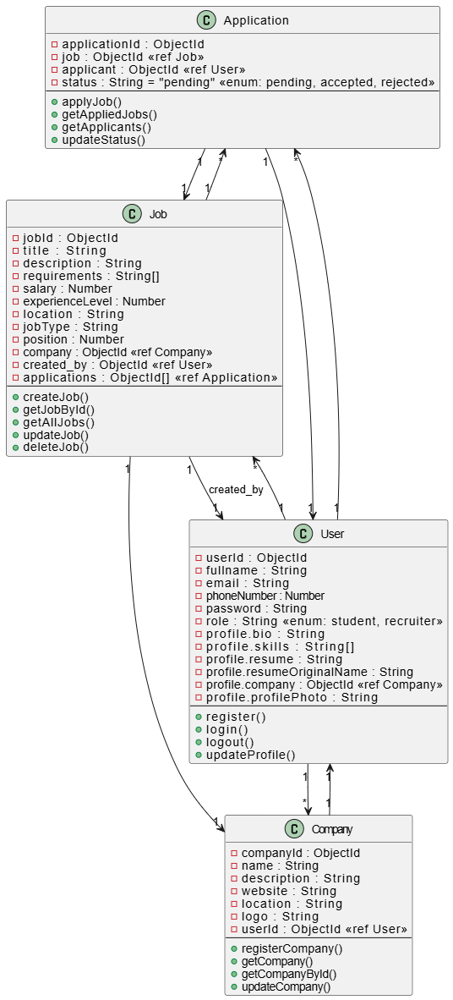

# ElevateU – Class Diagram

**Course:** IT643 - Software Design and Testing  
**Professor:** Ankush Chander  
**Project Title:** ElevateU  
**Team Members:**  
- Chinmai Kewlani *(Team Lead)* – [chinmaikewlani](https://github.com/chinmaikewlani)  
- Virag Koradiya – [Virag-Koradiya](https://github.com/Virag-Koradiya)  

---

## 📌 Overview
*ElevateU* is a job portal system designed to simplify the hiring process for both **students** and **recruiters**.  
It enables students to create profiles, upload resumes, apply to jobs, and track applications, while recruiters can post jobs, manage applicants, and create company profiles.  

The system is developed using the **MERN stack.**

---

## 📊 Class Diagram

---

## 🔗 Relationships
- A **User** can create multiple **Companies**.  
- A **User (Recruiter)** can create multiple **Jobs**.  
- A **User (Student)** can apply to multiple **Jobs** via **Applications**.  
- A **Job** belongs to one **Company** and one **Recruiter (User)**.  
- A **Job** can have multiple **Applications**.  
- An **Application** belongs to one **Job** and one **User (Student)**.  
- A **Company** is linked to its **creator (User)**.  

---

## ⚙️ Notes
- The class diagram merges **attributes** and **controller functions** inside each class for clarity.  
- All entity IDs (`userId`, `companyId`, `jobId`, `applicationId`) are represented as **ObjectId**.  
- The diagram reflects **role-based access**:  
  - Students → Apply for jobs, manage profiles.  
  - Recruiters → Post jobs, create companies, manage applicants.  

---

✨ This class diagram serves as a visual reference for understanding the **domain model** of *ElevateU*.
